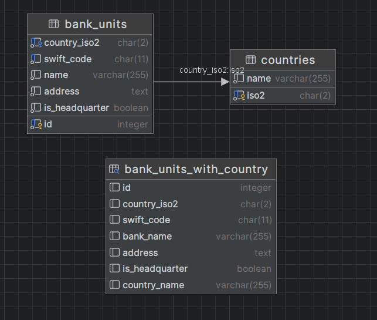

# SWIFT Codes API

A RESTful API service for managing SWIFT/BIC codes for financial institutions, built with Go.

## Project Overview

This service provides endpoints to:

- Retrieve bank information using SWIFT/BIC codes
- List all SWIFT code entries in a specific country
- Add new SWIFT code entries
- Remove SWIFT code entries

The application author is Piotr Karamon.

## Getting Started

### Prerequisites

- Docker and Docker Compose
- Go 1.23 or higher (for local development)

### Running the Application

1. Clone the repository:
    ```bash
    git clone https://github.com/pkaramon/swiftcodes.git
    cd swiftcodes
    ```

2. Start the application:
    ```bash
    docker-compose up --build
    ```

The API will be available at `http://localhost:8080`

### Running Tests

```bash
go test ./... -v
```

## Tech Stack

- Go 1.23
- PostgreSQL
- Docker & Docker Compose
- Gorilla Mux (HTTP router)
- pgx (PostgreSQL driver)
- testify (Testing framework)
- dockertest (Creating containers for tests)

## API Endpoints

### GET /v1/swift-codes/{swiftCode}

Retrieve details of a single SWIFT code, whether for a headquarters or branches.

**Response Structure for headquarter SWIFT code:**

```
{
    "address": string,
    "bankName": string,
    "countryISO2": string,
    "countryName": string,
    "isHeadquarter": true,
    "swiftCode": string,
    "branches": [
        {
            "address": string,
            "bankName": string,
            "countryISO2": string,
            "isHeadquarter": false,
            "swiftCode": string
        },
        ...
    ]
}
```

**Response Structure for branch SWIFT code:**

```
{
    "address": string,
    "bankName": string,
    "countryISO2": string,
    "countryName": string,
    "isHeadquarter": false,
    "swiftCode": string
}
```

### GET /v1/swift-codes/country/{countryISO2code}

Return all SWIFT codes with details for a specific country (both headquarters and branches).

**Response Structure:**

```
{
    "countryISO2": string,
    "countryName": string,
    "swiftCodes": [
        {
            "address": string,
            "bankName": string,
            "countryISO2": string,
            "isHeadquarter": bool,
            "swiftCode": string
        },
        ...
    ]
}
```

### POST /v1/swift-codes

Add new SWIFT code entries to the database for a specific country.

**Request Structure:**

```
{
    "address": string,
    "bankName": string,
    "countryISO2": string,
    "countryName": string,
    "isHeadquarter": bool,
    "swiftCode": string
}
```

**Response Structure:**

```
{
    "message": string
}
```

### DELETE /v1/swift-codes/{swiftCode}

Delete SWIFT code data if the `swiftCode` matches the one in the database.

**Response Structure:**

```
{
    "message": string
}
```

## Development

### Local Development Setup

1. Start PostgreSQL:
    ```bash
    docker-compose up db
    ```

2. Run the application:
    ```bash
    go run cmd/api/*.go
    ```

## Project structure 

Projects consists of the following packages:
- `csvmapper` - Allows mapping CSV rows to Go types
- `csvimport` - Imports initial data(countries, swift codes) from CSV files to the database
- `handlers` - Contains HTTP handlers for the API endpoints. They also contain business logic.
   I chose not to create separate service layer as application is small and handlers are simple.
- `middleware` - Contains only a basic logging middleware.
- `models` - Contains models for SWIFT code entries(they are called BankUnit in the code), SWIFT codes themselves and countries.
- `repository` - Contains only the repository interfaces.
- `postgres` - Contains repository implementations for PostgreSQL, as well as functions to create database connection, 
              set up the schema, and create a test database.

The `cmd/api` package contains the main application entry point.

## Database

Database uses two tables:

- `countries` - Stores ISO 3166-2 country codes and names
- `bank_units` - Stores bank branches and headquarters with their SWIFT/BIC codes

`bank_units` table has indexes for `swift_code`, `iso2`, base code (i.e. `LEFT(swift_code, 8)`) to
speed up reads.

There is also a view `bank_units_with_country` which simplies writing SQL queries.



`countries` tables needs to be popuplated in order for the application to work. This is done when the api starts.

## Tests

Tests in `csvimport` and `handlers` packages use a PostgreSQL container created with `dockertest` package.
This makes the tests slower but also make them more reliable as they run against a real database and not a mocked one.


## Data Sources

- Initial bank data is loaded from `initialData/swiftcodes.csv`
- Country codes are loaded from `initialData/countries_iso3166b.csv`

## License

MIT License
